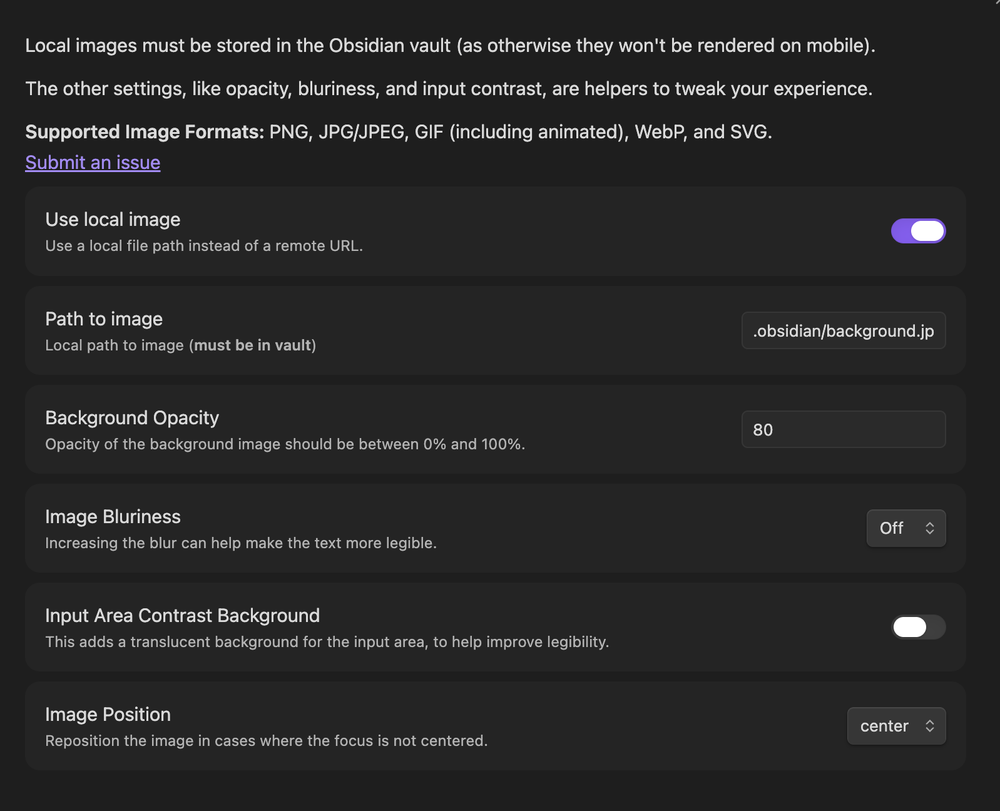

# Obsidian Editor Background Plugin

This plugin is meant to provide an aesthetic background for the Editor view of Obsidian.

As part of the settings, there's additional tweaking that's available, like modifying the
bluriness of the background, and the contrast of the input area.

I use animated gifs as my background, particularly ones by [waneella](https://waneella.com/).

## Settings Menu

## Example 1

This example uses no bluriness and default input area contrast.

## Example 2

This example uses high degree of bluriness, with no input area contrast.
